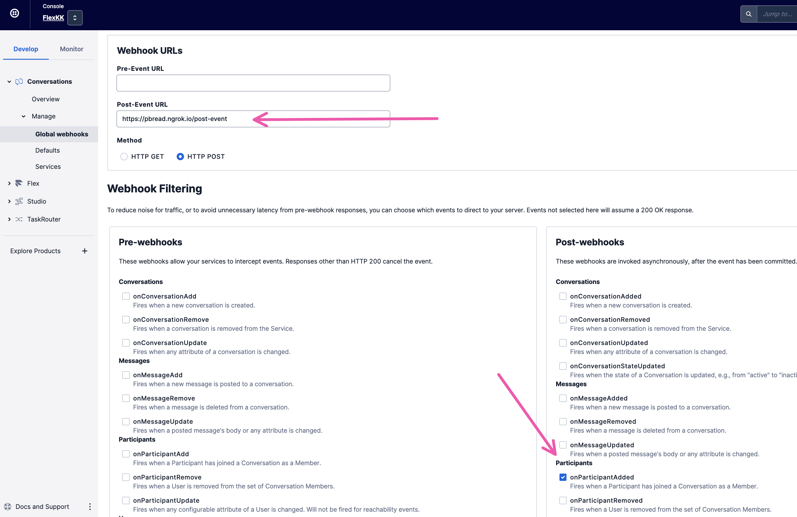

# Flex Reply To Work Around

Currently, the `Reply To` email header is not stored in the Conversation. To work around this limitation, the `Reply To` address will be concatenated to `messagingBinging.Name` property of the Conversation Participant, like so...

```json
{
  "accountSid": "ACxxxxxxxxxxxxxxxxxxxxxxxxxxxxxxxx",
  "attributes": "{}",
  "conversationSid": "CHxxxxxxxxxxxxxxxxxxxxxxxxxxxxxxxx",
  "dateCreated": "2023-02-09T18:18:00.000Z",
  "dateUpdated": "2023-02-09T18:18:00.000Z",
  "identity": null,
  "lastReadMessageIndex": null,
  "lastReadTimestamp": null,
  "messagingBinding": {
    "address": "from@example.com",
    "level": "to",
    "name": "Robert Hansen (reply to: replyto@example.com)",
    "type": "email"
  },
  "roleSid": "RLxxxxxxxxxxxxxxxxxxxxxxxxxxxxxxxx",
  "sid": "MBxxxxxxxxxxxxxxxxxxxxxxxxxxxxxxxx",
  "url": "https://conversations.twilio.com/v1/Conversations/CHxxxxxxxxxxxxxxxxxxxxxxxxxxxxxxxx/Participants/MBxxxxxxxxxxxxxxxxxxxxxxxxxxxxxxxx"
}
```

The `reply to` will need to be parsed from the participant's name, the original participant will be deleted, and a new participant will be created where the `messagingBinding.address` will be the `reply to`.

## Demo

### Add Env Variables

Change .env.example to .env

```bash
mv .env.example .env
```

Add your Twilio credentials to the environment variables

```.env
ACCOUNT_SID=ACxxxxxxxxxxxxxxxxxxxxxxxxxxxxxxxx
AUTH_TOKEN=xxxxxxxxxxxxxxxxxxxxxxxxxxxxxxxx
```

### Start the App

Open your terminal and start the app.

```bash
npm run start;
```

### Start a Tunnel

** You will need nGrok or some other tunneling program to expose your localhost process to public URL. **

Once you start your tunnel, copy the URL from the terminal. You will need to assign it to the Conversations Post Event webhook.

### Update the Conversations Service

Add the nGrok URL to the Conversation's post-event webhook and subscribe to the `onParticipantAdded` post-webhook event.


